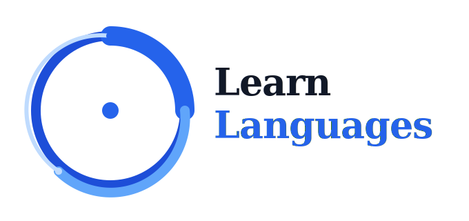

<p align="center"></p>

[中文](./README.zh-CN.md)

Full-stack language learning platform. AI-powered translation, dictionary lookups, text-to-speech, and card decks. Built on Next.js 16 with PostgreSQL.

## What it does

- **Translation** -- multi-language AI translation with automatic language detection and IPA phonetic annotation
- **Dictionary** -- AI-driven word lookup with part-of-speech analysis, definitions, and example sentences
- **SRT Player** -- subtitle file playback with per-word lookup links and auto-pause
- **Text-to-Speech** -- Alibaba Qwen TTS for natural pronunciation
- **Decks & Cards** -- create, manage, and study vocabulary with multiple review modes (sequential, random, infinite, dictation)
- **Social** -- public decks, favorites, user follows

## Stack

Next.js 16 (App Router) / React 19 / TypeScript / Tailwind CSS v4 / Prisma 7 / PostgreSQL / better-auth / next-intl (8 locales) / Zhipu AI / Alibaba Qwen TTS

## Getting started

You need Node.js 24+, PostgreSQL 14+, and pnpm.

```bash
git clone <repo-url>
cd learn-languages
pnpm install
cp .env.example .env.local
pnpm prisma generate
DATABASE_URL=your_db_url pnpm prisma migrate dev --name init
pnpm dev
```

Environment variables are documented in `.env.example`.

## Architecture

```
src/
├── app/              # Next.js routes (route groups: auth, account, learn)
│   └── api/auth/     # better-auth catch-all -- the only API route
├── modules/          # business logic (action → service → repository)
├── design-system/    # CVA primitives (14 files, flat, no subdirs)
├── components/       # business components (layout, follow, ui)
├── lib/              # integrations (db, auth, email, AI pipelines, logger)
├── hooks/            # useAudioPlayer, useFileUpload
├── utils/            # cn, validate, json, string, random
├── shared/           # business types and constants
└── i18n/             # next-intl config
```

Business modules follow a three-layer pattern. Each module has up to six files:

```
{name}-action.ts        # server actions
{name}-action-dto.ts    # zod schemas + types
{name}-service.ts       # business logic
{name}-service-dto.ts   # service types
{name}-repository.ts    # prisma queries
{name}-repository-dto.ts
```

AI-driven modules (translator, dictionary) skip the repository layer -- they call LLM pipelines directly.

AI pipelines live in `src/lib/bigmodel/`. Each is a multi-stage orchestrator: `orchestrator.ts` + `types.ts` + `stage{n}-name.ts`. Shared deps are `llm.ts` (Zhipu AI client) and `tts.ts` (Qwen TTS service).

## Conventions

- Server Components by default. Client Components only when needed (state, effects, browser APIs).
- Actions return `{ success: boolean; message: string; data?: T }` uniformly.
- Validation via Zod v4 schemas in `*-dto.ts` files, using `validate()` from `@/utils/validate`.
- Explicit path imports (`@/design-system/button`). No barrel exports except `src/lib/logger/`.
- No `index.ts` files. No `as any`. No `@ts-ignore`.
- Logging via Winston (`createLogger("module-name")`). No `console.log` in server code.
- All user-visible text must go through next-intl.

## Commands

```bash
pnpm dev                                       # dev server
pnpm build                                     # production build (used for verification)
pnpm lint                                      # ESLint
DATABASE_URL=... pnpm prisma migrate dev --name <name>   # schema migration (required, not db push)
DATABASE_URL=... pnpm prisma generate                     # regenerate client
```

## i18n

Supported: en-US, zh-CN, ja-JP, ko-KR, de-DE, fr-FR, it-IT, ug-CN.

Locale stored in cookie. No URL prefix, no middleware. Translation files are in `messages/*.json`.

Missing translations are not caught by the build. Use AST-grep to audit:

```bash
ast-grep --pattern 'useTranslations($ARG)' --lang tsx --paths src/
```

## Data model

```
User
├── Account
├── Session
├── Verification
├── Deck
│   ├── Card
│   │   └── CardMeaning
│   └── DeckFavorite
└── Follow
    ├── follower
    └── following
```

See `prisma/schema.prisma` for the full schema.

## License

AGPL-3.0-only. See [LICENSE](./LICENSE).
