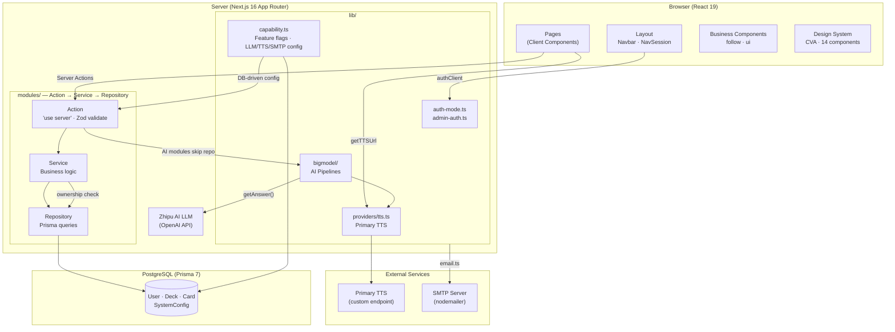

<p align="center"></p>

[中文](./README.zh-CN.md)

Full-stack language learning platform. AI-powered translation, dictionary lookups, text-to-speech, and card decks. Built on Next.js 16 with PostgreSQL.

## What it does

- **Translation** -- multi-language AI translation with automatic language detection and IPA phonetic annotation
- **Dictionary** -- AI-driven word lookup with part-of-speech analysis, definitions, and example sentences
- **SRT Player** -- subtitle file playback with per-word lookup links and auto-pause
- **Text-to-Speech** -- custom primary TTS endpoint for natural pronunciation
- **Decks & Cards** -- create, manage, and study vocabulary with drag-and-drop reordering and multiple review modes (sequential, random, infinite, dictation)
- **Social** -- public decks, favorites, user follows
- **Single-user mode** -- deploy without authentication, auto-creates a default admin user
- **Reading** -- AI-powered reading comprehension with sentence-by-sentence translation and word-level alignment
- **Compact Mode** -- toggleable high-density layout that maximizes information per screen
- **Admin Panel** -- password-protected admin dashboard for managing feature flags and service configurations

## Stack

Next.js 16 (App Router) / React 19 / TypeScript / Tailwind CSS v4 / Prisma 7 / PostgreSQL / better-auth / next-intl (9 locales) / OpenAI-compatible LLM / Custom TTS

## Getting started

You need Node.js 24+, PostgreSQL 14+, and pnpm.

```bash
git clone <repo-url>
cd learn-languages
pnpm install
cp .env.example .env.local
pnpm prisma generate
DATABASE_URL=your_db_url pnpm prisma db push
pnpm dev
```

Environment variables are validated at startup via `src/lib/env.ts` (Zod). Required vars (`DATABASE_URL`, `BETTER_AUTH_SECRET`) will crash immediately if missing. SMTP is required in multi-user mode, optional in single-user mode. Optional API keys (`LLM_*`) are validated on first use. Service configs (LLM, TTS, SMTP) and feature flags are stored in the database via the `system_config` table. See `.env.example` for details.

### Single-user mode

Set `NEXT_PUBLIC_AUTH_MODE=single` to skip authentication entirely. The app auto-creates a default admin user on first access. Auth pages (login, signup, etc.) return 404, and the navbar always shows the logged-in state.

This is useful for personal deployments where multi-user support is unnecessary.

## Architecture



### Three-layer pattern

Each business module has up to six files:

```
{name}-action.ts        # server actions
{name}-action-dto.ts    # zod schemas + types
{name}-service.ts       # business logic
{name}-service-dto.ts   # service types
{name}-repository.ts    # prisma queries
{name}-repository-dto.ts
```

AI-driven modules (translator, dictionary, reading) skip the repository layer -- they call LLM pipelines directly.

### AI pipelines

Located in `src/lib/bigmodel/`. Multi-stage orchestrator pattern: `orchestrator.ts` + `types.ts` + `stage{n}-name.ts`.

| Pipeline | Stages | LLM Calls | Purpose |
|----------|--------|-----------|---------|
| dictionary | 2 | 2 | Input preprocessing → entry generation |
| translator | 3 | 2-4 | Language detection → translation → optional IPA |
| reading | 2 | 1+N | Translate-split → per-sentence tokenize-align |
| ocr | 1 | 1 | Image vocabulary extraction (unused) |

Shared: `llm.ts` (OpenAI-compatible client), `tts.ts` (primary TTS service).

### Single/Multi-user mode

Controlled by `NEXT_PUBLIC_AUTH_MODE`. In single-user mode, `auth-mode.ts` auto-creates an admin user and `getCurrentUserId()` returns it directly without better-auth. Auth pages return 404. In multi-user mode, better-auth handles email/password with email verification.

### Capability system

Feature flags stored in DB (`SystemConfig`). Admin panel manages which features are enabled (signup, userProfile, social, email) -- all enabled by default, individually toggleable. All service configs (LLM, TTS, SMTP) are read from DB via `capability.ts`, not env vars.

## Conventions

- Server Components by default. Client Components only when needed (state, effects, browser APIs).
- Actions return `{ success: boolean; message: string; data?: T }` uniformly.
- Validation via Zod v4 schemas in `*-dto.ts` files, using `validate()` from `@/utils/validate`.
- Explicit path imports (`@/design-system/button`). No barrel exports except `src/lib/logger/`.
- No `index.ts` files. No `as any`. No `@ts-ignore`.
- Logging via Winston (`createLogger("module-name")`). No `console.log` in server code.
- All user-visible text must go through next-intl.

## Commands

```bash
pnpm dev                                       # dev server
pnpm build                                     # production build (used for verification)
pnpm lint                                      # ESLint
DATABASE_URL=... pnpm prisma db push                            # sync schema to database
DATABASE_URL=... pnpm prisma generate                            # regenerate client
```

## i18n

Supported: en-US, zh-CN, ja-JP, ko-KR, de-DE, fr-FR, it-IT, ug-CN, eo.

Locale stored in cookie. No URL prefix, no middleware. Translation files are in `messages/*.json`.

Missing translations are not caught by the build. Use AST-grep to audit:

```bash
ast-grep --pattern 'useTranslations($ARG)' --lang tsx --paths src/
```

## Data model

```
SystemConfig          # feature flags (signup, userProfile, social, email) + services config (single row)
ActivityLog           # audit trail of user operations (userId?, action, entityType?, ip?, userAgent?, metadata?)
User
├── Account
├── Session
├── Verification
├── Deck
│   ├── Card
│   │   └── CardMeaning
│   └── DeckFavorite
└── Follow
    ├── follower
    └── following
```

See `prisma/schema.prisma` for the full schema.

## License

AGPL-3.0-only. See [LICENSE](./LICENSE).
