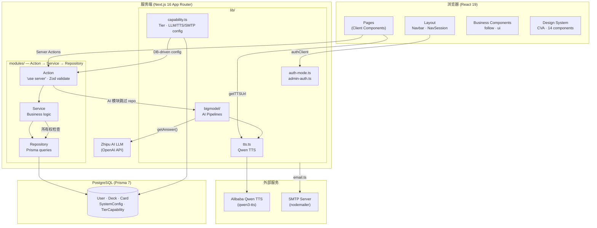

<p align="center"></p>

[English](./README.md)

全栈语言学习平台。AI 翻译、词典查询、语音合成、卡片管理。基于 Next.js 16 + PostgreSQL。

## 功能

- **翻译** -- 多语言 AI 互译，自动语言检测，IPA 音标标注
- **词典** -- AI 单词查询，词性分析、释义、例句
- **字幕播放器** -- SRT 字幕播放，逐词查词链接，自动暂停
- **语音合成** -- 阿里云千问 TTS，自然发音
- **牌组与卡片** -- 创建、管理、学习词汇，多种复习模式（顺序、随机、无限、听写）
- **社交** -- 公开牌组、收藏、用户关注
- **单用户模式** -- 无需认证即可部署，自动创建默认管理员用户
- **阅读理解** -- AI 驱动的阅读理解，逐句翻译+分词对齐
- **管理后台** -- 密码保护的管理面板，管理部署层级、服务配置和功能开关

## 技术栈

Next.js 16 (App Router) / React 19 / TypeScript / Tailwind CSS v4 / Prisma 7 / PostgreSQL / better-auth / next-intl (8 语言) / OpenAI 兼容 LLM / 阿里云千问 TTS

## 快速开始

需要 Node.js 24+、PostgreSQL 14+、pnpm。

```bash
git clone <repo-url>
cd learn-languages
pnpm install
cp .env.example .env.local
pnpm prisma generate
DATABASE_URL=your_db_url pnpm prisma migrate dev --name init
pnpm dev
```

环境变量通过 `src/lib/env.ts` (Zod) 在启动时校验。必填变量（`DATABASE_URL`、`BETTER_AUTH_SECRET`）缺失时会立即崩溃。SMTP 在多用户模式下必填，单用户模式下可选。可选 API Key（`LLM_*`、`DASHSCORE_API_KEY`）在首次使用时校验。服务配置（LLM、TTS、SMTP）和功能开关存储在数据库的 `system_config` 和 `tier_capabilities` 表中。详见 `.env.example`。

### 单用户模式

设置 `NEXT_PUBLIC_AUTH_MODE=single` 可完全跳过认证。应用首次访问时自动创建默认管理员用户。认证页面（登录、注册等）返回 404，导航栏始终显示已登录状态。

适合不需要多用户支持的个人部署场景。

## 架构



### 三层模式

每个业务模块最多六个文件：

```
{name}-action.ts        # Server Actions
{name}-action-dto.ts    # Zod schemas + 类型
{name}-service.ts       # 业务逻辑
{name}-service-dto.ts   # Service 类型
{name}-repository.ts    # Prisma 查询
{name}-repository-dto.ts
```

AI 驱动的模块（translator、dictionary、reading）跳过 repository 层，直接调用 LLM 管道。

### AI 管道

位于 `src/lib/bigmodel/`。多阶段 orchestrator 模式：`orchestrator.ts` + `types.ts` + `stage{n}-name.ts`。

| 管道 | 阶段 | LLM 调用 | 用途 |
|------|------|---------|------|
| dictionary | 2 | 2 | 输入预处理 → 词条生成 |
| translator | 3 | 2-4 | 语言检测 → 翻译 → 可选 IPA |
| reading | 2 | 1+N | 翻译拆句 → 逐句分词对齐 |
| ocr | 1 | 1 | 图片词汇提取（未使用） |

共享：`llm.ts`（OpenAI 兼容 LLM 客户端）、`tts.ts`（千问 TTS 服务）。

### 单/多用户模式

由 `NEXT_PUBLIC_AUTH_MODE` 控制。单用户模式下，`auth-mode.ts` 自动创建 admin 用户，`getCurrentUserId()` 直接返回，不经过 better-auth。认证页面返回 404。多用户模式下，better-auth 处理邮箱/密码认证及邮箱验证。

### 能力系统

部署层级和功能开关存储在数据库（`SystemConfig` + `TierCapability`）。管理面板控制功能启用（signup、userProfile、social、email）。所有服务配置（LLM、TTS、SMTP）通过 `capability.ts` 从数据库读取，非环境变量。

## 约定

- 默认 Server Components。仅在需要时用 Client Components（state、effects、浏览器 API）。
- Actions 统一返回 `{ success: boolean; message: string; data?: T }`。
- 验证用 Zod v4，schema 放在 `*-dto.ts`，通过 `@/utils/validate` 的 `validate()` 调用。
- 显式路径导入（`@/design-system/button`）。除 `src/lib/logger/` 外禁止 barrel exports。
- 不创建 `index.ts`。不用 `as any`。不用 `@ts-ignore`。
- 日志用 Winston（`createLogger("module-name")`）。服务端代码禁止 `console.log`。
- 所有用户可见文本走 next-intl。

## 命令

```bash
pnpm dev                                       # 开发服务器
pnpm build                                     # 生产构建（用于验证）
pnpm lint                                      # ESLint
DATABASE_URL=... pnpm prisma migrate dev --name <name>   # 数据库迁移（必须，禁止 db push）
DATABASE_URL=... pnpm prisma generate                     # 重新生成 Client
```

## 国际化

支持：en-US, zh-CN, ja-JP, ko-KR, de-DE, fr-FR, it-IT, es-ES, ug-CN。

Locale 存在 cookie 中，无 URL 前缀，无 middleware。翻译文件在 `messages/*.json`。

翻译缺失不会被 build 捕获。用 AST-grep 审计：

```bash
ast-grep --pattern 'useTranslations($ARG)' --lang tsx --paths src/
```

## 数据模型

```
SystemConfig          # 部署层级 + 服务配置 (单行)
TierCapability        # 按层级的功能开关 (signup, userProfile, social, email)
User
├── Account
├── Session
├── Verification
├── Deck
│   ├── Card
│   │   └── CardMeaning
│   └── DeckFavorite
└── Follow
    ├── follower
    └── following
```

完整 schema 见 `prisma/schema.prisma`。

## 许可证

AGPL-3.0-only。见 [LICENSE](./LICENSE)。
